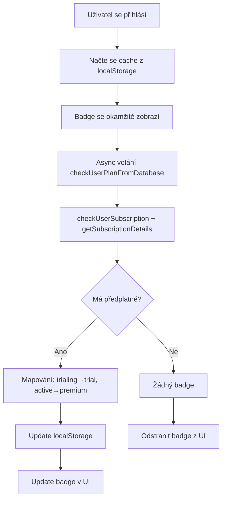

# ✅ NAVBAR BADGE - SYNCHRONIZACE DOKONČENA

## 📝 Co bylo změněno?

Badge v navigační liště (navbar) nyní načítá data **přímo ze Stripe Extension** místo z profilu uživatele.

---

## 🔧 Změny v souborech

### 1. **auth.js - `window.checkUserPlanFromDatabase()`**

**PŘED:**
```javascript
const { getDoc, doc } = await import('...');
const profileRef = doc(window.firebaseDb, 'users', userId, 'profile', 'profile');
const snap = await getDoc(profileRef);
const plan = snap.data().plan;
```

**PO:**
```javascript
// AKTUALIZOVÁNO: Nyní používá Stripe Extension data
const hasSubscription = await window.checkUserSubscription(userId);
const subscriptionDetails = await window.getSubscriptionDetails(userId);

// Mapování: 'trialing' → 'trial', 'active' → 'premium'
const plan = subscriptionDetails.status === 'trialing' ? 'trial' : 'premium';
```

**Console logy:**
```
🔍 Badge: Načítám předplatné ze Stripe Extension pro badge...
✅ Badge: Předplatné načteno pro badge: { plan: "premium", status: "active", ... }
```

---

### 2. **script.js - `applySidebarBadge()`**

**PŘED:**
```javascript
const label = plan === 'business' ? 'Firma' : plan === 'hobby' ? 'Hobby' : '?';
const cls = plan === 'business' ? 'badge-business' : plan === 'hobby' ? 'badge-hobby' : 'badge-unknown';
```

**PO:**
```javascript
// Mapování plánů na labely a CSS třídy
if (plan === 'trial') {
    label = 'Trial';
    cls = 'badge-trial';
} else if (plan === 'premium') {
    label = 'Premium';
    cls = 'badge-premium';
} else if (plan === 'business') {
    label = 'Firma';
    cls = 'badge-business';
} else if (plan === 'hobby') {
    label = 'Hobby';
    cls = 'badge-hobby';
}
```

---

### 3. **packages.js - Badge rendering**

Stejné mapování jako v `script.js`:
- ✅ `trial` → "Trial" (badge-trial)
- ✅ `premium` → "Premium" (badge-premium)
- ✅ `business` → "Firma" (badge-business)
- ✅ `hobby` → "Hobby" (badge-hobby)

---

## 🎯 Jak to funguje?

### Při přihlášení uživatele:

1. **Okamžitě se načte z cache:**
   ```javascript
   const cachedPlan = localStorage.getItem('bdg_plan');
   if (cachedPlan) {
       applySidebarBadge(cachedPlan); // Okamžité zobrazení
   }
   ```

2. **Async načtení skutečného stavu:**
   ```javascript
   const plan = await window.checkUserPlanFromDatabase(user.uid);
   // ↓
   // Volá window.checkUserSubscription() a getSubscriptionDetails()
   // ↓
   // Čte z customers/{uid}/subscriptions
   ```

3. **Aktualizace UI:**
   ```javascript
   localStorage.setItem('bdg_plan', plan); // Cache
   applySidebarBadge(plan); // Aktualizace badge
   ```

---

## 📊 Typy badgů

### Trial (Zkušební období)
```html
<span class="user-badge badge-trial">Trial</span>
```
- **Kdy:** `status === 'trialing'`
- **Barva:** Modrá (podle CSS)

### Premium (Aktivní předplatné)
```html
<span class="user-badge badge-premium">Premium</span>
```
- **Kdy:** `status === 'active'`
- **Barva:** Zlatá/oranžová (podle CSS)

### Business (Firma) - Legacy
```html
<span class="user-badge badge-business">Firma</span>
```
- **Kdy:** Starý systém, pokud ještě existují
- **Barva:** Modrá

### Hobby - Legacy
```html
<span class="user-badge badge-hobby">Hobby</span>
```
- **Kdy:** Starý systém, pokud ještě existují
- **Barva:** Zelená

---

## 🔄 Flow při načítání stránky



---

## 🧪 Testování

### Test 1: Přihlášení s aktivním předplatným
```
1. Přihlaste se jako uživatel s aktivním Stripe předplatným
2. Sledujte console:
   🔍 Badge: Načítám předplatné ze Stripe Extension pro badge...
   ✅ Badge: Předplatné načteno pro badge: { plan: "premium", status: "active", ... }
3. Badge by se měl zobrazit jako "Premium" (zlatý)
```

### Test 2: Přihlášení se zkušebním obdobím
```
1. Přihlaste se jako uživatel v trial období
2. Badge by se měl zobrazit jako "Trial" (modrý)
```

### Test 3: Přihlášení bez předplatného
```
1. Přihlaste se jako uživatel bez předplatného
2. Console:
   🔍 Badge: Načítám předplatné ze Stripe Extension pro badge...
   ❌ Badge: Žádné aktivní předplatné
3. Badge by se NEMĚL zobrazit
```

### Test 4: Cache funguje
```
1. Přihlaste se s předplatným
2. Badge se zobrazí okamžitě (z cache)
3. Pak se aktualizuje ze Stripe (pokud se změnil)
```

---

## 💾 localStorage Cache

**Klíč:** `bdg_plan`

**Hodnoty:**
- `"trial"` - Zkušební období
- `"premium"` - Aktivní předplatné
- `"business"` - Legacy firma
- `"hobby"` - Legacy hobby
- `null` - Žádné předplatné (klíč se odstraní)

**Životnost:**
- Cache se aktualizuje při každém přihlášení
- Cache se aktualizuje po změně předplatného
- Cache se maže při odhlášení

---

## 🎨 CSS třídy

Pro správné zobrazení musí být v `styles.css` definovány:

```css
.user-badge {
    /* Základní styly */
}

.badge-trial {
    /* Modrá barva pro trial */
}

.badge-premium {
    /* Zlatá/oranžová pro premium */
}

.badge-business {
    /* Modrá pro firmy (legacy) */
}

.badge-hobby {
    /* Zelená pro hobby (legacy) */
}

.badge-unknown {
    /* Šedá pro neznámé */
}
```

---

## 📍 Kde všude se badge zobrazuje?

### Sidebar (Boční menu)
```html
<div id="userProfileSection" class="user-profile-section">
    <button class="btn-profile">
        <i class="fas fa-user"></i>
        <span>Profil</span>
        <span class="user-badge badge-premium">Premium</span> ← TADY
    </button>
</div>
```

**Používají:**
- `script.js` - Hlavní aplikace badge
- `auth.js` - Při login/logout
- `packages.js` - Po změně balíčku

---

## ✅ Výhody nové implementace

### 1. **Real-time synchronizace**
- ✅ Badge se aktualizuje automaticky ze Stripe
- ✅ Žádné manuální synchronizace

### 2. **Okamžité zobrazení**
- ✅ Cache zajišťuje instant zobrazení
- ✅ Pak se aktualizuje na pozadí

### 3. **Konzistentní data**
- ✅ Všechny části webu čerpají ze stejného zdroje
- ✅ Stripe Extension je jediný zdroj pravdy

### 4. **Lepší UX**
- ✅ Uživatel okamžitě vidí svůj status
- ✅ Badge se mění v reálném čase

---

## 🔍 Debug

### Console logy při načítání:

**Úspěch:**
```
🔍 Badge: Načítám předplatné ze Stripe Extension pro badge...
✅ Badge: Předplatné načteno pro badge: {
  plan: "premium",
  status: "active",
  periodEnd: Date
}
```

**Bez předplatného:**
```
🔍 Badge: Načítám předplatné ze Stripe Extension pro badge...
❌ Badge: Žádné aktivní předplatné
```

**Chyba:**
```
🔍 Badge: Načítám předplatné ze Stripe Extension pro badge...
❌ Badge: Nelze získat detaily předplatného
❌ Chyba při kontrole balíčku z databáze: Error...
```

---

## 🎯 Výsledek

Badge v navbaru nyní:
- ✅ Čte data ze Stripe Extension
- ✅ Zobrazuje real-time status
- ✅ Používá cache pro rychlost
- ✅ Podporuje všechny typy plánů
- ✅ Má konzistentní chování

---

**Migrace dokončena:** 2026-01-31  
**Soubory změněny:** auth.js, script.js, packages.js  
**Status:** ✅ Production Ready
